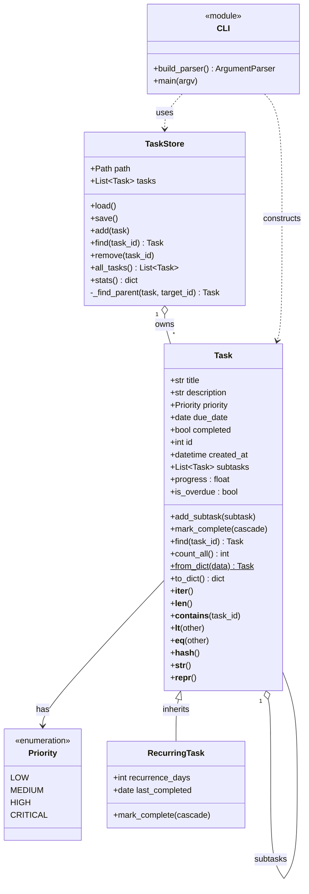

# TaskForge

A hierarchical command-line task manager. Tasks can have subtasks (which can
have their own subtasks), and some tasks can **recur** — completing them
reschedules the due date instead of closing them for good.

Built for CIT 411 (Programming with Python, Summer A 2026) as an end-to-end
capstone: a proper `src/` layout package, dataclasses, inheritance,
recursion, JSON persistence, logging, error handling, and an `argparse`
CLI, all tied together into something you'd actually use from a terminal.

## Purpose

Flat to-do lists break down once a task is really a small project
("Launch website") made of smaller steps ("Design homepage", "Write copy").
TaskForge lets you nest tasks arbitrarily deep, tracks completion
percentage automatically as subtasks finish, and supports recurring
chores (e.g. "Water plants every 7 days") that never get lost — they just
come back due on schedule.

## Install

.

```bash
git clone https://github.com/moha2004/taskforge.git
cd taskforge
pip install -e .
```

`pip install -e .` puts a `taskforge` command on your PATH, backed by the
source in `src/taskforge/` (editable install — code changes take effect
immediately, no reinstall needed).

For running the test suite:

```bash
pip install -e ".[dev]"
pytest
```

## Usage examples

By default, TaskForge stores its data at `~/.taskforge/tasks.json`. Pass
`--db path/to/file.json` to use a different file (handy for demos or
multiple task lists). Every command also accepts `-v`/`--verbose` for
debug-level logging.

Add a task, then break it into subtasks:

```
$ taskforge --db demo.json add "Launch website" -p HIGH --due 2026-08-01
Added: [ ] #1 Launch website (High) - 0.0%

$ taskforge --db demo.json add "Design homepage" --parent 1
Added: [ ] #2 Design homepage (Medium) - 0.0%

$ taskforge --db demo.json add "Write copy" --parent 1
Added: [ ] #3 Write copy (Medium) - 0.0%
```

Add a recurring task:

```
$ taskforge --db demo.json add "Water plants" --recur 7 --due 2026-07-01
Added: [ ] #4 Water plants (Medium) - 0.0% [recurs every 7d]
```

List everything as a tree:

```
$ taskforge --db demo.json list
[ ] #1 Launch website (High) - 0.0%
  [ ] #2 Design homepage (Medium) - 0.0%
  [ ] #3 Write copy (Medium) - 0.0%
[ ] #4 Water plants (Medium) - 0.0% [recurs every 7d]
```

Complete a subtask — the parent's progress updates automatically:

```
$ taskforge --db demo.json complete 2
Completed: [x] #2 Design homepage (Medium) - 100.0%

$ taskforge --db demo.json show 1
[ ] #1 Launch website (High) - 50.0%
  [x] #2 Design homepage (Medium) - 100.0%
  [ ] #3 Write copy (Medium) - 0.0%
Progress: 50.0%  Overdue: False
```

Complete the recurring task — it reschedules instead of closing:

```
$ taskforge --db demo.json complete 4
Completed: [ ] #4 Water plants (Medium) - 0.0% [recurs every 7d]

$ taskforge --db demo.json show 4
[ ] #4 Water plants (Medium) - 0.0% [recurs every 7d]
Progress: 0.0%  Overdue: False
```

(Its due date rolled from `2026-07-01` to `2026-07-08`.)

Sort by priority/due date, and check overall stats:

```
$ taskforge --db demo.json list --sort
[ ] #1 Launch website (High) - 50.0%
  [x] #2 Design homepage (Medium) - 100.0%
  [ ] #3 Write copy (Medium) - 0.0%
[ ] #4 Water plants (Medium) - 0.0% [recurs every 7d]

$ taskforge --db demo.json stats
Total tasks: 4
Completed:   1
Overdue:     0
```

Errors are caught and reported cleanly (exit code 1):

```
$ taskforge --db demo.json show 999
Error: No task with id 999
```

> **Screenshots:** add terminal screenshots of the commands above to
> `docs/screenshots/` and reference them here, e.g.
> ``, before submitting.

## Architecture overview



**Package layout**

```
taskforge/
├── pyproject.toml          # src-layout packaging, console_scripts entry point
├── requirements.txt        # dev/test dependencies (pytest)
├── README.md
├── ADR.md                  # Architecture Decision Log
├── PROJECT_BRIEF.md
├── .gitignore
├── src/
│   └── taskforge/
│       ├── __init__.py     # public API surface
│       ├── models.py       # Task, RecurringTask, Priority
│       ├── storage.py      # TaskStore (JSON persistence)
│       ├── cli.py          # argparse CLI, entry point
│       └── exceptions.py   # TaskForgeError hierarchy
├── tests/
│   └── test_models.py
└── docs/
    └── screenshots/
```

**Design notes**

- `Task` is a `@dataclass` because it's fundamentally a bag of fields
  (title, priority, due date, ...) plus a list of child `Task`s. Using
  `@dataclass(eq=False, repr=False)` opts out of the auto-generated
  `__eq__`/`__repr__` so the hand-written, id-based versions (see
  "Dunder methods" below) are used instead.
- `RecurringTask(Task)` is the one inheritance relationship: it's a
  `Task` in every respect except that `mark_complete()` rolls the due
  date forward instead of leaving the task closed. This is a single
  method override, not a branch sprinkled through the rest of the
  codebase — the polymorphism does the work.
- `TaskStore` is deliberately **not** a dataclass — its job is behavior
  (reading/writing JSON, searching, aggregating stats), not just holding
  fields, so a regular class fits better.
- Because tasks form a tree, several operations are recursive by nature
  rather than by choice: `progress` (roll subtask completion up to the
  parent), `to_dict`/`from_dict` (serialize/rebuild a whole subtree),
  `find`/`count_all` (walk the subtree), and `TaskStore._find_parent`.
- **Dunder methods implemented:** `__init__` (dataclass-generated),
  `__post_init__` (validation), `__repr__`, `__str__`, `__eq__`,
  `__hash__`, `__lt__`, `__len__`, `__contains__`, `__iter__` — each
  backs a real CLI behavior (sorting, membership checks, tree walks,
  aggregate stats).

## Credits

Built by Mohamed Salem Maidan and Daniel Zayas for CIT 411 – Python
Programming, Atlantis University, taught by Professor Parnell Dujor.
